# Phenology Analysis

     
Alpine Wildflower Phenology study conducted by the Independence Pass Foundation (IPF): This analysis will begin to compare the result of the study over the last few years and incoorporate some weather data in order to see if any relationships or trends can be determined between summer rain or winter snow and the apparent health of the wildflowers. It is recognized that more data will be needed to draw any conclusions about weather and climate trends and their impacts on high altitude wildflowers; this analysis is initial and will be adjusted and modified as more questions come up and more data is collected. The length and timing of blooms is of particular interest due to declining populations of pollinators and their apparent delayed appearance on the Pass each year.

From the IPF Executive Director, Karin Teague:
The phenology study is intended to provide baseline data on the species types, numbers, and timing of bloom of plants living in the alpine and sub-alpine regions of Independence Pass, which will be invaluable in assessing the effects of climate change in our region, and provide insight as to which types of plants will most successfully be used in IPF revegetation projects. We hope also these studies will help foster in our community a greater curiosity and intimacy with our local flora, which many people already have a great affinity for, as in time (after some number of years of data collection) we are able to share our findings more broadly.

## Study Parameters
The study takes place each year from June though September at the Upper Lost Man/Linkins Lake Trailhead on Independence Pass. Four study transects along the Linkins Lake trail were selected to represent four different micro-climates/habitat attributes. Each transect is twelve feet wide (six feet on either side of the trail) by 25 feet long. The transects were selected along to trail to reduce impacts to the mountain tundra from weekly visits. 

* Transect 1: This transect is located near the parking lot not far from the river and contains shrubs(not included in the study) and is fairly wet. Elevation: 11,552ft
* Transect 2: This transect is slightly higher in elevation, on a sunny hillside that is fairly dry and southeast facing. Elevation: 11,722ft
* Transect 3: This transect is at Linkins Lake and near apline wetlands that exist near the outlet of the lake, very wet. Elevation: 12,031ft
* Transect 4: This transect is the highest in elevation on a south facing hillside above the lake. This is the most alpine of the transects and fairly dry and rocky. Elevation: 12,204ft
     
## Analysis
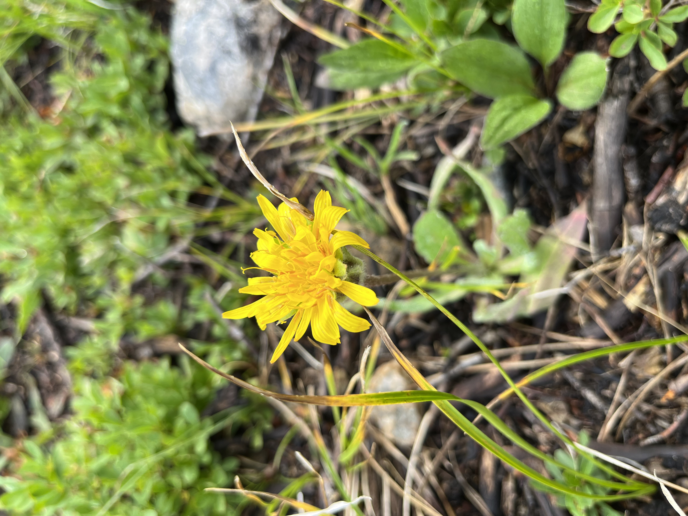

Comparing differnt years at each transect

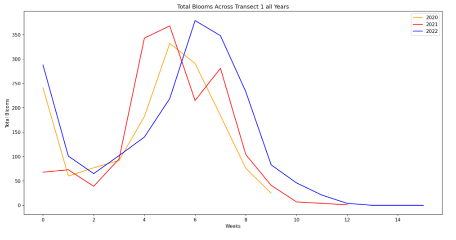

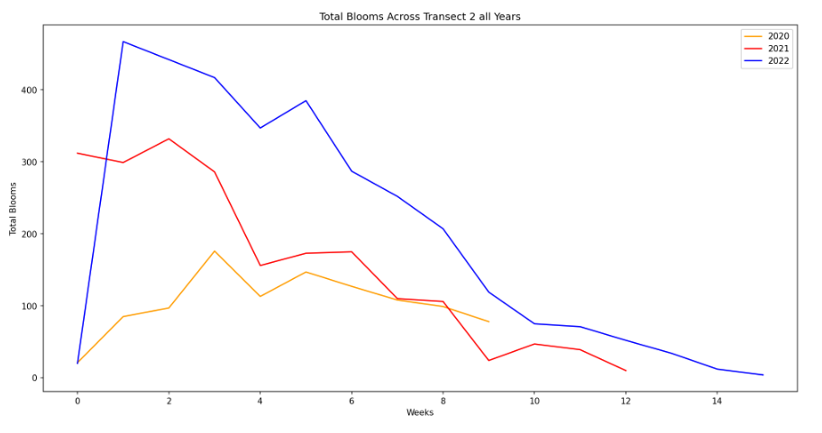

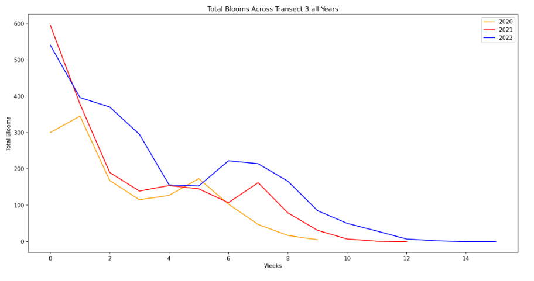

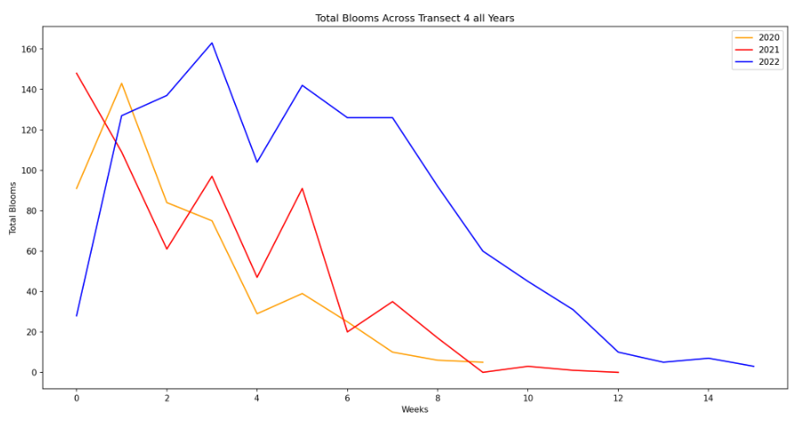

Comparing transects in each year

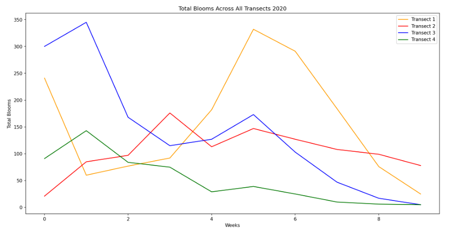

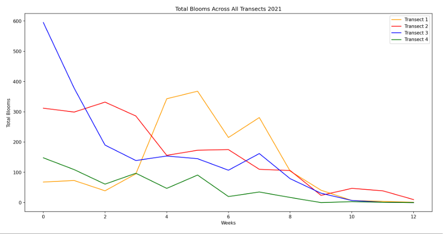

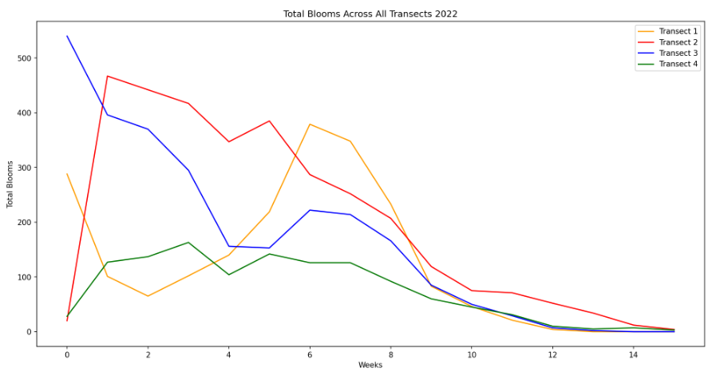

### Results
One question we hoped to answer is about the timing of the blooms; in order to see which species bloom when and for how long, I calculated for how many weeks each species blooms for. This can give us an idea of generally how long each species blooms in the summer months and then we can look at some weather data to see if this has influences over that. The analysis then averages the length each species in each transect bloomed for over the three years of study so far. The results of this show that some species only bloom for a week and others average 7 weeks for example. It should also be noted that some species have a second bloom later on and this is not portrayed in the average weeks blooming for each species. A few that bloomed again include: Potentilla glaucophylla, Viola adunca, and Sibbaldia procumbens

#### Longest blooming species on average: 
* Transect 1: Aconitum columbianum, Senecio triangularis, Rhodiola rhodanthum
* Transect 2: Achillea millefolium, Antennaria corymbosa, Heterotheca pumila
* Transect 3: Pedicularis sudetica, Antenaria corymbosa, Bistorta vivipara
* Transect 4: Soldiago simplex var. nanum, Sedum lanceolatum, Draba aurea

For each transect the species average bloom lengths:
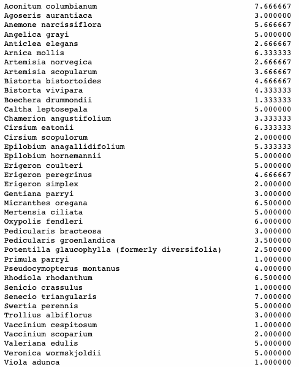
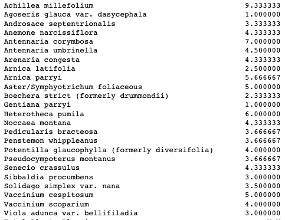
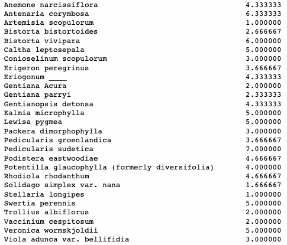
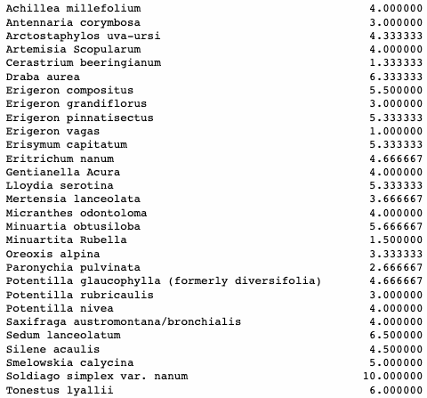

## Future Questions
