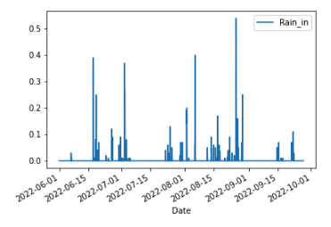

# Phenology Analysis

     
     
Alpine Wildflower Phenology study conducted by the Independence Pass Foundation (IPF): This analysis will begin to compare the results of the study over the last few years and incoorporate some weather data in order to see if any relationships or trends can be determined between summer rain or winter snow and the apparent health of the wildflowers. It is recognized that more data will be needed to draw any conclusions about weather and climate trends and their impacts on high altitude wildflowers; this analysis is initial and will be adjusted and modified as more questions come up and more data is collected. The length and timing of blooms is of particular interest due to declining populations of pollinators and their apparent delayed appearance on the Pass each year.

From the IPF Executive Director, Karin Teague:
The phenology study is intended to provide baseline data on the species types, numbers, and timing of bloom of plants living in the alpine and sub-alpine regions of Independence Pass, which will be invaluable in assessing the effects of climate change in our region, and provide insight as to which types of plants will most successfully be used in IPF revegetation projects. We hope also these studies will help foster in our community a greater curiosity and intimacy with our local flora, which many people already have a great affinity for, as in time (after some number of years of data collection) we are able to share our findings more broadly.

## Study Parameters
The study takes place each year from June though September at the Upper Lost Man/Linkins Lake Trailhead on Independence Pass. Four study transects along the Linkins Lake trail were selected to represent four different micro-climates/habitat attributes. Each transect is twelve feet wide (six feet on either side of the trail) by 25 feet long. The transects were selected along to trail to reduce impacts to the mountain tundra from weekly visits. 

* Transect 1: This transect is located near the parking lot not far from the river and contains shrubs(not included in the study) and is fairly wet. Elevation: 11,552ft
* Transect 2: This transect is slightly higher in elevation, on a sunny hillside that is fairly dry and southeast facing. Elevation: 11,722ft
* Transect 3: This transect is at Linkins Lake and near apline wetlands that exist near the outlet of the lake, very wet. Elevation: 12,031ft
* Transect 4: This transect is the highest in elevation on a south facing hillside above the lake. This is the most alpine of the transects and fairly dry and rocky. Elevation: 12,204ft
     
## Analysis
To view the graphs interactively, visit Tableau Public at this [link]().

### Weather Data
In order to make determinations about the impacts of weather and climate on wildflower species on Independence Pass, various weather metrics are provided here. It is acknowledged that many years of data will be necessary to draw any meaningful conclusions about climate change impacts. The hope here is that some anecdotal observations and correlations can guide future research into the subject, or at least keep us looking for proper metrics and how to pair it with the study. Below I have listed from the Independence Pass Snotel site #542 some precipition statistcs from the years that correlate to the study. It should be noted that this weather station is at Latitude: 39 deg; 5 min N, Longitude: 106 deg; 37 min W and an Elevation of 10598 feet, which is lower than the area of study. This data was selected over the ACGI weather station at the summit because it has accumulative precipitation totals, whereas the summit station provides snow depth. The data was also more consistent and seemed more accurate; for instance there are sometimes months of data missing from the summit station. It should be noted that the snow depths at the top fo the Pass are significantly higher. The 2019 max snow depth is included for comparison. It should also be noted that the data/stats refer to water year (October 1-September 30) vs. calendar year.

##### Yearly Precip Stats (inches)

accum_precip_2019 = 32.9 (inches of water)\
max_sn_depth_2019 = 81 (inches of snow)\
acgi_max_depth_2019 = 57 (in of snow)\
melt_date_2019 = 6/12/2019\
28.8/32.9 (inches of water) = 87.5% fell as snow

accum_precip_2020 = 28.1\
max_sn_depth_2020 = 63\
melt_date_2021 = 5/23/2020\
21.4/28.1 = 76.2% fell as snow

accum_precip_2021 = 25.7\
max_sn_depth_2021 = 54\
melt_date_2021 = 5/24/2021\
17.6/25.7 = 68.5% fell as snow

accum_precip_2022 = 28.3\
max_sn_depth_2022 = 53\
melt_date_2019 = 6/3/2022\
18.9/28.3 = 66.7% fell as snow

Some take aways to keep in mind when comparing the phenolgy data: 
* The winter of 2019 had the most snow of any winter leading up to the study years. Most of that years precip fell in the winter; the summer was pretty dry. This year is included as a potential metric for delayed superbloom type events. For instance, a connection between superblooms of monument plants correlate with high precip 4 years prior.
* Both 2021 and 2022 had more rain than 2020 during the typical monsoon months
* The first years of the study had somewhat consistent accumulative precipitation numbers and melt dates
* Of the three years, 2020 had more snow 

### Comparing different years at each transect

In light of the weather stats above, the following graphs show the total blooms at each transect comparing the three study years. Peak bloom time is consistently in July both for total blooms and species diversity. 2022 shows a trend of more blooming plants in the alpine transect #4, though 2022 had generally higher numbers than the previous two years. When trying to draw conclusions as this relates to weather, 2022 had the lowest percentage of precip that fell as snow, indicating the wildflowers potentially responded well to the consistent rain this summer.

#### Looking more closely at 2022
Comparing transects in 2022:

Perhaps the most interesting peak in 2022 was the number of species found at the alpine plot #4, which consistently throughout the summer had many more species than in previous years and they bloomed for longer periods of time

And a look at the consistent rain recieved in summer of 2022.

### Results
One question we hoped to answer is about the timing of the blooms; in order to see which species bloom when and for how long, I calculated for how many weeks each species blooms for. This can give us an idea of generally how long each species blooms in the summer months and then we can look at some weather data to see if this has influences over that. The analysis then averages the length each species in each transect bloomed for over the three years of study so far. The results of this show that some species only bloom for a week and others average 7 weeks for example. It should also be noted that some species have a second bloom later on and this is not portrayed in the average weeks blooming for each species. A few that bloomed again include: Potentilla glaucophylla, Viola adunca, and Sibbaldia procumbens

#### Longest blooming species on average: 
* Transect 1: Aconitum columbianum, Senecio triangularis, Rhodiola rhodanthum
* Transect 2: Achillea millefolium, Antennaria corymbosa, Heterotheca pumila
* Transect 3: Pedicularis sudetica, Antenaria corymbosa, Bistorta vivipara
* Transect 4: Soldiago simplex var. nanum, Sedum lanceolatum, Draba aurea

##### Transect 1 species average bloom length: Total species found in plot throught the study is 39

##### Transect 2 species average bloom length: Total species found in plot throught the study is 24

##### Transect 3 species average bloom length: Total species found in plot throught the study is 27

##### Transect 4 species average bloom length: Total species found in plot throught the study is 29

Peak bloom time is consistently in July both for total blooms and species diversity. 

## Future Questions
This analysis focused on total blooms and total species. The focus of the weather data was also on precipitation. Given more time there could be some other interesting things to look at including air temperature, soil temperature, and soil moisture content. Once there is enough data a machine learning model could be applied. Once there is more data the weather data could be further refined and compared.

### Some things to consider for future study:
* Are there any noteable superblooms? And can they be traced back to an unusual weather event?
* If the snow melts earlier in the year, are the wild flowers blooming earlier? How can this be paired with pollinator studies?
* Which plants tend to thrive during the hotter, drier summers?
